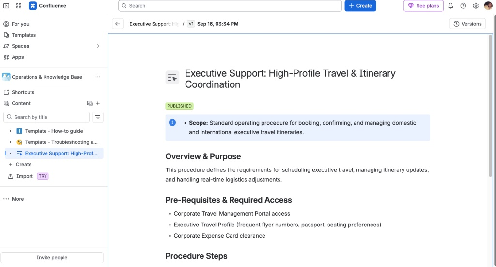

# Enterprise Knowledge Base (Atlassian Confluence)

This guide highlights operational knowledge management procedures built inside **Atlassian Confluence**, demonstrating cross-functional documentation standards for enterprise teams.

---

## Executive Travel & Logistics SOP

The following published SOP outlines standard operating procedures for executive itinerary coordination, utilizing Confluence macros (such as status badges and info callouts) for enhanced scannability.

*Figure 1: Published Executive Support SOP view inside the Operations & Knowledge Base space.*

---

## Core Enterprise Features Implemented
* **Custom Space Architecture:** Structured under the `Operations & Knowledge Base` space for quick team navigation.
* **Status Tracking:** Integrated status macros (`PUBLISHED`) for document lifecycle management.
* **Info Callouts:** Embedded scope notes to highlight prerequisites and access requirements.