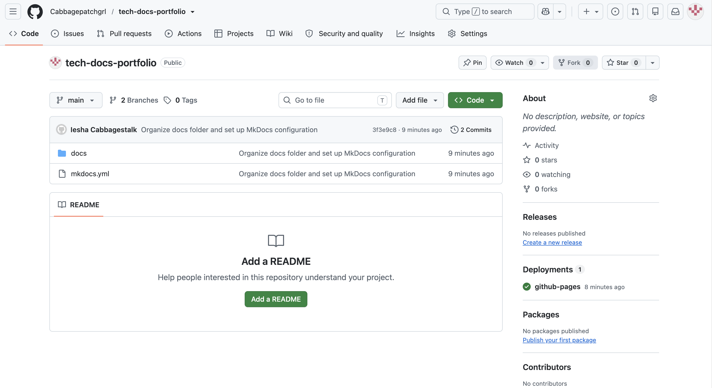

# GitHub Quickstart for Technical Documentation

This guide outlines the standard procedure for navigating a GitHub repository, viewing documentation source files, and tracking version history.

---

## 1. Navigating the Repository Code View

The primary repository view displays all project files, directories, and configuration settings required to build documentation.

### Key Components:
- **`docs/`**: Directory containing all source Markdown files (`.md`).
- **`mkdocs.yml`**: System configuration file for navigation and styling.
- **Repository Header**: Displays active branch, commit history, and deployment status.

*Figure 1: Main code directory view for the documentation workspace.*

---

## 2. Managing File Branches

Before making updates to live documentation, writers verify they are working on the correct working branch.

1. Click the **Branch** dropdown in the top-left corner of the code view.
2. Select `main` for published documentation or search for your feature branch.
3. Review recent commit messages to ensure your local environment is up to date.

---

## Summary
By following these navigation steps, technical writers can easily maintain version control integrity and streamline collaborative documentation updates.